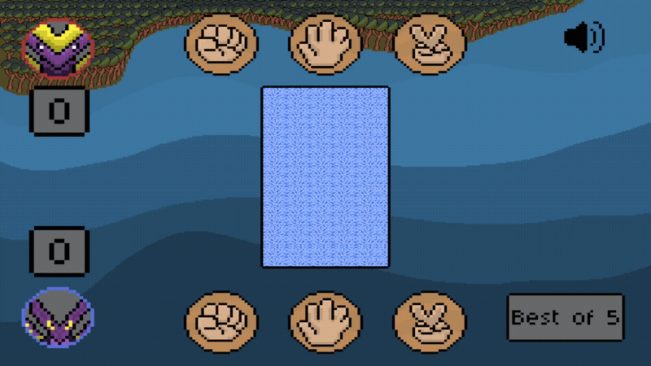
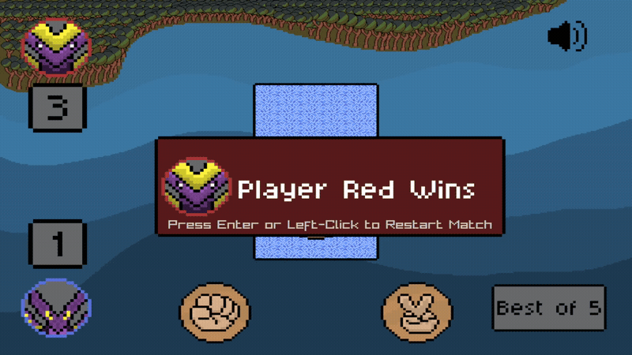

# Rock Paper Scissor

- A small single-player Rock-Paper-Scissors game developed in C++ using raylib.
- The project was created as a learning project to practice game phases, player input, simple AI behavior, animations, audio, and general game logic.

### Gameplay

The player selects Rock, Paper or Scissor and competes against a randomly controlled computer opponent. The first player to reach 3 points wins the match.

### Mute Button & Match Reset

The background music can be muted during gameplay. After a player reaches 3 points, a new match can be started using Enter or the left mouse button.

`gameplay` manages the general game flow and round logic, including:

- Round reset
- Player and computer choices
- Result detection
- Point counting
- Match winning conditions
- Starting a new match
- Result timer
- Round-related states

## Features

- Single player Rock-Paper-Scissors gameplay
- Player vs. computer
- Clickable Rock, Paper and Scissor selection
- Random computer choice
- Animated movement of the selected icons
- Hidden computer choice before reveal
- Rock-Paper-Scissors result detection
- Draw detection
- Point counter for both players
- First player to reach 3 points wins the match
- Match restart with Enter or left mouse button
- Visual arrows for the round winner
- Visual draw indicators
- Player winning screens
- Music mute button
- Choice sound effects
- Point winning sound
- Draw sound
- Match winning sound
- Background music
- Custom window icon
- Custom executable icon
- Custom pixel-art graphics

## Project Structure

The project uses a procedural structure with separate files for different responsibilities.

### Player

`player` manages player-related behavior, including:

- Player choice
- Computer choice
- Icon positions
- Player icon movement
- Computer icon movement
- Computer choice reveal

### Graphics

`graphics` manages the visual assets and drawing, including:

- Rock, Paper and Scissor textures
- Playground graphics
- Player icons
- Point counter graphics
- Winner graphics
- Draw graphics
- Winner arrows
- Volume icon
- Loading and unloading textures

### Audio

`audio` manages the audio assets, including:

- Background music
- Choice sound
- Point winning sound
- Draw sound
- Match winning sound
- Loading and unloading audio assets
- Music volume control

## RpsPhases

The game uses different phases to control the current situation of a round or match.

enum class RpsPhase
{
    PlayerBlueChoice,
    PlayerRedAI,
    TurnRpsIntoOne,
    MovePlayerRed,
    RevealPlayerRed,
    ShowResult,
    PlayerRedWins,
    PlayerBlueWins,
    StartNewMatch
};

## Player Choices

The game uses separate enums to store the choices of both players.

enum class RPSP1
{
    Rock,
    Paper,
    Scissor
};

enum class RPSP2
{
    Rock,
    Paper,
    Scissor
};

## Built with

- C++17
- raylib
- Aseprite
- Visual Studio Code
- Git / GitHub

## Learning Goals

This project was created to practice and improve my understanding of:

- Procedural programming in C++
- Structs and functions
- References and parameters
- Enums and game phases
- Boolean states
- State-based game logic
- Collision detection
- Mouse input
- Simple computer-controlled choices
- Position and movement logic
- Timers using GetFrameTime()
- Update and draw logic
- Sound effects and music
- Runtime volume control
- Loading and unloading assets
- Windows executable resources and custom icons
- Separating code into multiple header and source files
- Git and GitHub